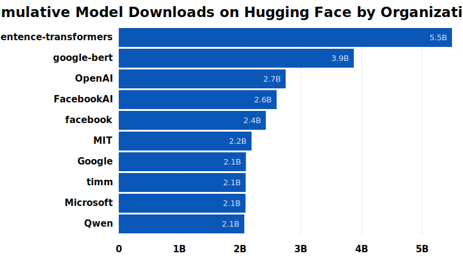
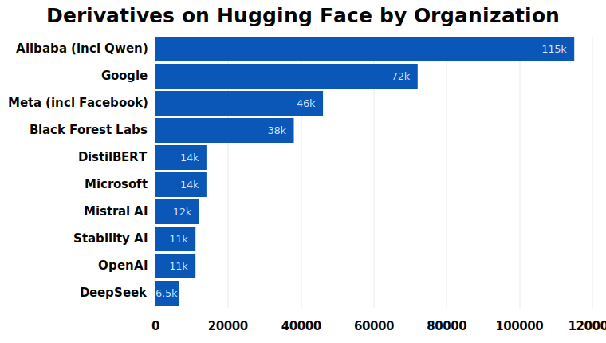
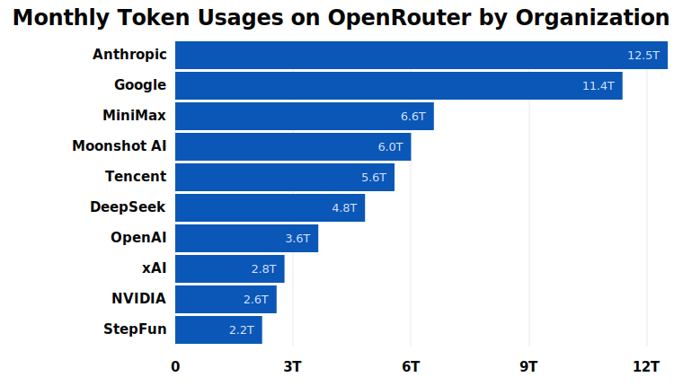
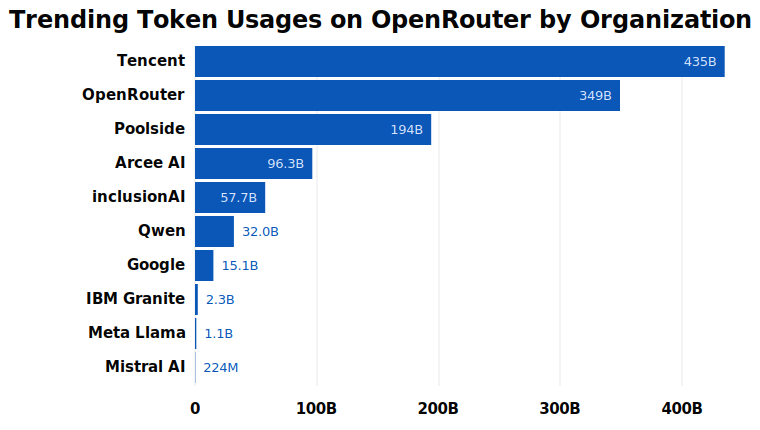

```markdown
## Prompt
1. 你是一个基于详实数据进行分析、观察和总结的 AI 生态研究者；
2. 你需要基于开发者生态数据和产业新闻，对大模型生态、 Agentic AI 的相关洞察内容处理成下面的报告；
3. 在内容撰写上，你不能做一个冰冷的数字观察者，而是要在详实数据辅助的基础上，使用朴实、简单、具有人情味的的文字风格撰写文章；
4. 在你需要进行修改/扩充/重写的地方，我用 > review： 这种格式做了点评，需要你基于 review 建议做优化；
5. 随时进入 DeepResearch 模式，检索你可以引用的外部数据资料。
```

# Agentic AI 2026: 当黑客松式的狂欢沉淀下来，我们期望一个 Inclusive 的 AGI 未来

## 写在前面：当黑客松快要结束

过去一年，我们一直用“真实世界里的黑客松”来形容大模型开发生态。这个比喻是准确的。它有热闹、速度、偶然、天才时刻，也有混乱、重复、短命项目和被快速遗忘的仓库。

去年 5 月，我们发布大模型开发生态全景时的判断是：AI 已经超过 Cloud Native，成为 GitHub 开发者协作中最有影响力的技术方向；DeepSeek 带来的热潮让 GitHub Trending 上一度 94% 的项目都与 AI 相关；一批项目在几天或几周内拿到几万关注度，又很快失去活跃度。

来到 2026 年中，体感发生了变化。

变化不只是“又多了几个 Agent 项目”，而是软件生产模式本身在移动。过去，开发者用软件完成工作；现在，Agent 开始直接使用工具、读写文件、调用 API、发起 PR、跑测试、做代码审查。过去软件为人设计 UI，现在越来越多软件开始为 Agent 提供入口。Axios 在 2026-05-05 的一篇报道里用了一个很贴切的说法：今天的 Agent 像自动驾驶车，被迫在为人类设计的道路上行驶；但产业正在为 Agent 修新的路，核心不再只是界面，而是 API、数据和权限。[^axios-agent-software]

所以本文的问题不是“Agentic AI 有没有泡沫”。泡沫当然有。更重要的问题是：当黑客松式的狂欢沉淀下来，软件会走向哪里？开发者会变成什么？开源还剩下什么位置？以及我们为什么仍然需要一个 inclusive AGI 的叙事。

## 一、从静态全景图，到动态排行榜

去年我们做大模型开发生态全景时，花了很多力气去回答一个问题：哪些项目值得被放进这张图里。那时这个问题很自然，因为生态还在从 LLM SDK、RAG、Agent Framework、应用平台和推理基础设施中慢慢分层。我们希望通过筛选，给开发者留下一张相对清晰的地图。而从下半年开始，这件事情变得越来越难。

火爆项目仍然会不断出现，尤其是基于模型能力之上长出来的项目，获得注意力的成本也在变低。OpenClaw 从 2025 年 11 月上线，到 2026 年 2 月冲过 20 万关注度，只用了 84 天，而定义了现代前端开发的软件基础设施 React，达到这个数字用了将近十年。这不是说 OpenClaw 已经拥有 React 那样的工程影响力。React 的影响力写在无数生产系统、框架生态和开发者习惯里。这个对比真正说明的是另一件事：GitHub 的注意力分发机制、AI 时代的传播速度，以及开发者对 Agentic 软件的期待，都已经变了。

OpenClaw 之后，ZeroClaw、Hermes Agent、各种 Claude Code skills 和 agent harness 项目很快出现，热度也很大。但这些项目的生命力究竟有多强，我们很难在它们爆红的那一刻做出判断。我们能感受到的是，一张静态生态图的更新速度，已经远远跟不上这些项目的潮涨潮落。

所以这一次，我们不再像去年那样，每次发布都尝试罗列出“此刻最火”的项目，再做一次人工筛选。更合理的方式，是把这个生态中出现过、被开发者真实互动过的项目纳入一张持续更新的排行榜，再用活跃度、关注度、参与者和趋势曲线一起观察它们。

从 2026 年 4 月的活跃度看，真正站在龙头位置的，已经不是单一类型项目。OpenClaw 以 1,285.80 位居第一，Claude Code 为 810.36，OpenAI Codex、Hermes Agent、OpenCode 都在 470 左右；同时，PyTorch、vLLM、SGLang、TensorRT-LLM 这些底层基础设施仍然排在前列。这说明 Agentic AI 的中心不是一个“Agent Framework”市场，而是 Agent 产品、coding agent、推理基础设施和开发者工具共同组成的执行栈。

另一面也同样重要。很多曾经很热的项目，并没有消失，但已经从爆发期进入退潮期。Dify 的活跃度从过去 12 个月高点 571.03 回落到 146.73，vLLM 从 823.50 回落到 497.03，Open WebUI 从 304.63 回落到 94.30，Cline 从 228.22 回落到 54.24。这类回落不等于失败，更可能意味着项目从爆发增长进入维护、商业化或平台化阶段。

还有一些项目更接近“浪花”。比如 OpenManus 仍有 56,083 关注度，但 2026 年 4 月活跃度只有 1.53，参与者为 5；AutoGen 仍有 57,823 关注度，但活跃度从 93.58 回落到 5.53。它们都曾经代表一个产业时刻，但关注度留下来了，持续协作未必留下来。

这正是我们改用排行榜的原因。Agentic AI 生态不是一张可以半年更新一次的大图，而是一条不断翻涌的河。我们需要记录浪花，也需要分辨水流。

## 二、平台的信号

GitHub 在 Octoverse 2025 中披露：平台已有 180M+ 开发者；2025 年新增超过 36M 开发者；全年新增 121M 仓库，总仓库数达到 630M；开发者每分钟创建超过 230 个新仓库；每月平均合并 43.2M 个 PR；超过 1.1M 个 public repositories 已经引入 LLM SDK，同比增长 178%；AI-related repositories 超过 4.3M，较 2023 年几乎翻倍。[^github-octoverse-growth][^github-octoverse-ai]

这次我们用 OpenDigger ClickHouse 的 GitHub 事件流做了一个更贴近开发活动的口径：统计每年 1-4 月在事件流中活跃过的 distinct 仓库、开发者和 bot/app actor。这里的 bot/app actor 使用 `actor_login LIKE '%[bot]'` 作为近似口径，不等同于 GitHub 官方 App 注册数，但可以观察自动化账号在开发流程里的渗透速度。

GitHub Jan-Apr active metrics


| 年份   | 1-4 月活跃仓库  | 1-4 月活跃开发者 | 1-4 月活跃 bot/app actor |
| ---- | ---------- | ---------- | --------------------- |
| 2017 | 7,148,267  | 3,499,277  | 112                   |
| 2018 | 8,805,571  | 4,497,820  | 575                   |
| 2019 | 10,376,397 | 5,265,963  | 1,136                 |
| 2020 | 14,117,929 | 6,292,574  | 1,367                 |
| 2021 | 18,584,580 | 7,419,376  | 1,745                 |
| 2022 | 21,229,477 | 8,454,952  | 2,428                 |
| 2023 | 24,959,936 | 9,670,747  | 3,465                 |
| 2024 | 23,626,210 | 10,852,722 | 5,372                 |
| 2025 | 26,318,045 | 12,328,829 | 7,871                 |
| 2026 | 27,106,771 | 13,016,143 | 17,285                |


这组数据里，最稳的是开发者活跃度。2017 年 1-4 月，GitHub 事件流里有 349.9 万活跃开发者；到 2026 年同期，这个数字变成 1,301.6 万，接近 3.7 倍。活跃仓库也从 714.8 万上升到 2,710.7 万，约 3.8 倍。中间并不是一条完全平滑的直线，2024 年活跃仓库曾有回落，但 2026 年同期仍然创下十年最高值。

最值得注意的是 bot/app actor。2017 年 1-4 月，事件流里只有 112 个活跃 bot/app actor；2020 年超过 1,000 个，2025 年同期达到 7,871 个，2026 年同期直接上升到 17,285 个。也就是说，自动化账号的活跃规模在十年窗口里增长了 154 倍，并且 2026 年前四个月已经超过 2025 年同期的 2 倍。它不只是 CI/CD bot 变多了，也反映了更多自动化工具、依赖更新器、代码助手、Agent 工作流开始进入真实协作链路。

再看 2026 年 1-4 月全站活跃度和新增关注度最高的 20 个仓库，两个榜单放在一起，差异很明显。活跃度更接近真实协作，关注度增长更接近注意力流向。四个月累计口径会抹平一部分单月波动，所以它更像一个“年初到现在”的平台体温：GitHub 的协作中心仍然很工程化，但 Agent 和 coding 工具已经挤进了中心。


| 排名  | 活跃度 Top 20 项目         | 2026-01 至 04 活跃度 | 新增关注度 Top 20 项目       | 2026-01 至 04 新增关注度 |
| --- | ---------------------------------------------- | ---------------- | ------------------------------------- | ------------------ |
| 1   | `llvm/llvm-project`                            | 6,162.64         | `openclaw/openclaw`                   | 105,180            |
| 2   | `NixOS/nixpkgs`                                | 5,267.83         | `affaan-m/everything-claude-code`     | 37,969             |
| 3   | `openclaw/openclaw`                            | 4,656.53         | `obra/superpowers`                    | 35,500             |
| 4   | `anthropics/claude-code`                       | 3,452.56         | `anomalyco/opencode`                  | 31,131             |
| 5   | `odoo/odoo`                                    | 3,065.02         | `ultraworkers/claw-code`              | 25,592             |
| 6   | `microsoft/vscode`                             | 2,785.42         | `anthropics/skills`                   | 24,863             |
| 7   | `pytorch/pytorch`                              | 2,777.51         | `NousResearch/hermes-agent`           | 21,550             |
| 8   | `elastic/kibana`                               | 2,731.65         | `nextlevelbuilder/ui-ux-pro-max-skill` | 17,705             |
| 9   | `Expensify/App`                                | 2,429.91         | `msitarzewski/agency-agents`          | 16,683             |
| 10  | `zephyrproject-rtos/zephyr`                    | 2,383.72         | `forrestchang/andrej-karpathy-skills` | 16,263             |
| 11  | `anomalyco/opencode`                           | 2,315.49         | `anthropics/claude-code`              | 15,215             |
| 12  | `home-assistant/core`                          | 2,292.67         | `karpathy/autoresearch`               | 14,848             |
| 13  | `vllm-project/vllm`                            | 2,281.81         | `garrytan/gstack`                     | 14,750             |
| 14  | `microsoft/winget-pkgs`                        | 2,108.48         | `code-yeongyu/oh-my-openagent`        | 14,713             |
| 15  | `tenstorrent/tt-metal`                         | 1,919.84         | `thedotmack/claude-mem`               | 13,478             |
| 16  | `zed-industries/zed`                           | 1,917.52         | `gsd-build/get-shit-done`             | 13,359             |
| 17  | `sgl-project/sglang`                           | 1,846.95         | `VoltAgent/awesome-design-md`         | 12,729             |
| 18  | `openai/codex`                                 | 1,790.10         | `VoltAgent/awesome-openclaw-skills`   | 12,154             |
| 19  | `department-of-veterans-affairs/va.gov-team`   | 1,787.66         | `koala73/worldmonitor`                | 12,105             |
| 20  | `grafana/grafana`                              | 1,616.77         | `ComposioHQ/awesome-claude-skills`    | 11,892             |


这张表很有意思。全站最活跃的仓库仍然不是被 AI 项目完全占领，`llvm`、`nixpkgs`、`odoo`、`vscode`、`pytorch`、`kibana`、`zephyr`、`grafana` 这些长期基础设施和生产系统非常稳。但 AI 已经不再是边缘类别：OpenClaw 排到全站活跃度第 3，Claude Code 第 4，OpenCode、vLLM、SGLang、Codex 都进入 Top 20。换句话说，AI 不是替代了 GitHub 原有的工程协作中心，而是直接挤进了中心。

两张榜单放在一起看，差异更清楚。活跃度 Top 20 更像 GitHub 的“生产系统”：大型基础设施、开发工具、AI runtime 和 coding agent 混在一起；关注度增长 Top 20 更像 GitHub 的“情绪温度计”：OpenClaw 四个月新增 105,180 个关注度，明显领先，其后是 Claude Code skills、OpenCode、Hermes Agent、skills 集合、memory、agent harness 和个人 workflow 工具。很多 skills/awesome/meme 型仓库关注度增长很快，但未必已经形成同等规模的协作网络；相反，OpenClaw、Claude Code、OpenCode 这类项目同时出现在活跃度或关注度榜单前列，说明它们不只是被围观，也确实在吸收协作。

但 GitHub 只回答了一半问题：大家在怎么一起写代码。另一半发生在模型平台上：一个模型被多少人找到、下载、改造、接进自己的产品里。Hugging Face 是最适合横向看的平台之一。它的 Hub API 可以按 `downloads`、`likes`、`lastModified` 等字段列出模型、数据集和 Spaces；其中 `downloads` 是最近 30 天滚动下载量，适合观察最近被用得多不多，`likes` 更接近模型社区里的关注度。[^hf-hub-api][^hf-download-stats]

`cfahlgren1/hub-stats` 的全量快照里，Hugging Face 已经有 2,858,420 个模型记录。按 `createdAt` 年份看，2022 年新增 100,596 个，2023 年新增 319,864 个，2024 年新增 745,112 个，2025 年新增 1,149,636 个；2026 年截至 5 月 9 日，已经新增 543,212 个。[^hf-hub-stats] 这不是简单的“模型更多了”，而是模型正在变成一种日常发布物：有人发布 foundation model，有人做 fine-tune，有人做 quantization，有人上传 adapter，有人把同一个能力搬到不同格式和运行环境里。

| 年份 | Hugging Face 新增模型数 | 年末累计模型数 |
| ---: | ---: | ---: |
| 2022 | 100,596 | 100,596 |
| 2023 | 319,864 | 420,460 |
| 2024 | 745,112 | 1,165,572 |
| 2025 | 1,149,636 | 2,315,208 |
| 2026 YTD | 543,212 | 2,858,420 |

如果按模型任务和模态粗分，Hugging Face 也已经不是单纯的 LLM 仓库。这个快照里，约 195.2 万个模型没有清晰的 `pipeline_tag`，这说明平台上有大量模型卡片并没有被规范标注，不能简单归类。已标注的部分里，Text & code 仍然最大，有 582,693 个；Image & vision 有 138,818 个；RL & robotics 有 91,040 个；Audio & speech 有 41,399 个；Multimodal & video 有 34,729 个。这个分布很能说明问题：文本模型仍然是主干，但图像、语音、多模态和机器人相关模型已经在平台上形成了自己的长尾。

| 模型任务/模态 | 模型数 |
| --- | ---: |
| Unknown / not tagged | 1,951,878 |
| Text & code | 582,693 |
| Image & vision | 138,818 |
| RL & robotics | 91,040 |
| Audio & speech | 41,399 |
| Multimodal & video | 34,729 |
| Other | 16,194 |
| Tabular & time series | 1,669 |

如果看全平台完整累计下载量，再按 author 聚合，头部会更偏向那些长期被程序调用的基础模型组织。`sentence-transformers`、`google-bert`、OpenAI、FacebookAI、MIT、Google、timm、Microsoft、Qwen 都在前列。这说明模型生态里的“使用量”不只属于最新的大模型，很多 embedding、BERT、CLIP、vision/audio 基础件，已经在无数应用里安静地跑了很久。



截至本次检索，Hugging Face 最近 30 天下载量最高的模型仍然以 embedding、BERT、CLIP、reranker、Qwen 等“被大量程序调用的基础件”为主；关注度最高的模型则更偏向大模型和生成式模型，如 DeepSeek-R1、FLUX、Stable Diffusion、Llama、Whisper、Kokoro 等。[^hf-models-downloads][^hf-models-likes]


| 排名  | Hugging Face 近 30 天下载量代表模型                                    | 近 30 天下载量 | Hugging Face 关注度代表模型                       | 关注度    |
| --- | ------------------------------------------------------------- | --------- | ------------------------------------------ | ------ |
| 1   | `sentence-transformers/all-MiniLM-L6-v2`                      | 249.5M    | `deepseek-ai/DeepSeek-R1`                  | 13,323 |
| 2   | `Qwen/Qwen3-VL-2B-Instruct`                                   | 187.0M    | `black-forest-labs/FLUX.1-dev`             | 12,769 |
| 3   | `google-bert/bert-base-uncased`                               | 61.8M     | `stabilityai/stable-diffusion-xl-base-1.0` | 7,696  |
| 4   | `google/electra-base-discriminator`                           | 56.2M     | `CompVis/stable-diffusion-v1-4`            | 7,006  |
| 5   | `sentence-transformers/paraphrase-multilingual-MiniLM-L12-v2` | 46.4M     | `meta-llama/Meta-Llama-3-8B`               | 6,531  |
| 6   | `cross-encoder/ms-marco-MiniLM-L6-v2`                         | 44.2M     | `hexgrad/Kokoro-82M`                       | 6,113  |
| 7   | `BAAI/bge-small-en-v1.5`                                      | 37.1M     | `meta-llama/Llama-3.1-8B-Instruct`         | 5,798  |
| 8   | `sentence-transformers/all-mpnet-base-v2`                     | 36.8M     | `openai/whisper-large-v3`                  | 5,658  |
| 9   | `openai/clip-vit-large-patch14`                               | 27.4M     | `bigscience/bloom`                         | 5,002  |
| 10  | `BAAI/bge-m3`                                                 | 22.1M     | `stabilityai/stable-diffusion-3-medium`    | 4,949  |


同一个数据集还提供了累计下载量、license、author 和 `baseModels`。如果看累计下载量，头部更加“朴素”：`google-bert/bert-base-uncased` 约 28.9 亿次，`sentence-transformers/all-MiniLM-L6-v2` 约 27.2 亿次，`MIT/ast-finetuned-audioset-10-10-0.4593` 约 21.8 亿次，`Falconsai/nsfw_image_detection` 约 13.5 亿次，`sentence-transformers/all-mpnet-base-v2` 约 12.1 亿次。很多真正被长期使用的模型，并不总是站在新闻中心。

同一个数据集也能看到谁在大量发布模型。按 author/org 统计，模型数量最多的是 `mradermacher`（63,698 个）、`RichardErkhov`（26,277 个）、`Krabat`（12,206 个）、`xueyj`（11,984 个）、`SALUTEASD`（7,022 个）。这些数字要小心读：它们不等于影响力本身，很多来自量化、转换、镜像和批量上传。但它说明模型平台已经不只是“论文模型的陈列柜”，也变成了一个很忙的加工厂。

再看 `baseModels`，也就是哪些模型最常被别人继续改造。`black-forest-labs/FLUX.1-dev` 有 37,503 个衍生模型，`Qwen/Qwen1.5-0.5B` 有 32,531 个，`Qwen/Qwen1.5-1.8B` 有 30,627 个，`google/gemma-2b` 有 24,026 个，`distilbert/distilbert-base-uncased` 有 11,899 个。这里能看到另一种生命力：不是一次发布时有多响，而是后来有多少人愿意拿它继续做自己的东西。



这和 GitHub 的信号不同。GitHub 的活跃度榜单里，Agent、coding 工具和底层工程项目正在上升；Hugging Face 的下载量榜单里，真正被高频使用的往往是 embedding、reranker、BERT/CLIP 这类“沉默的基础件”。它们未必有最强的社交传播，但每天被无数应用、脚本、检索系统和推理服务调用。换句话说，GitHub 告诉我们开发者在造什么，Hugging Face 告诉我们模型在被怎么用、被怎么改。

ModelScope 则提供了另一个窗口。它更靠近中文开源模型生态和模型即服务入口，尤其是 Qwen、DeepSeek、FunASR、SWIFT、EvalScope 等项目周边。ModelScope SDK 源码显示，平台提供模型详情、数据集详情、文件列表、版本/提交历史等接口；社区文章也显示，ModelScope 在推进 API-Inference，让开发者可以通过平台直接调用开源模型。[^modelscope-sdk-api][^modelscope-inference-api] 但和 Hugging Face 相比，ModelScope 目前可公开、稳定复用的全站下载/收藏排行榜接口还需要进一步确认。因此本文先把它作为中文模型生态和 MaaS 入口来观察，而不强行和 Hugging Face 做同口径排行榜对比。

把 GitHub 和 Hugging Face 放在一起看，已经可以得到一个初步判断：模型没有让软件变少，反而让软件的边界变宽了。

GitHub 说明，开发活动还在增长，自动化账号也在快速进入协作链路。Hugging Face 说明，模型正在像软件包一样被下载、复用、改造和派生。两者合起来看，模型和软件不是简单的替代关系，而是在重新分工：模型负责理解、生成、推理和调用工具；软件负责把模型放进可靠的工作流里，管理数据、权限、状态、成本、审计和交付。

这也解释了为什么接下来不能只用一张“项目列表”来看 Agentic AI。我们需要把生态拆成三层：**model layer**、**model infra layer**、**agent & application layer**。模型层回答“能力从哪里来”；模型基础设施层回答“能力如何稳定、便宜、可观测地跑起来”；Agent 和应用层回答“能力最后替谁做事”。这三层不是上下游那么简单，而是彼此牵引：更强的模型会催生新的应用，更真实的应用会倒逼 infra 变强，更成熟的 infra 又会让更多模型进入生产。

于是，那个绕不开的问题就来了：软件会不会被模型吞噬？开发者会不会被 AI 取代？SaaS 会不会也不再存在？后面每一层都会反复遇到这些问题。我们先不急着给一个宏大的答案，而是用这一层层具体项目，看今天已经发生的变化里，能不能看到一点未来的形状。

## 三、黑客松结束后，软件会走向何方？

2011 年，Marc Andreessen 写下“Software is eating the world”。他的核心判断是，越来越多行业会被软件重塑，赢家会是那些把业务变成软件系统的公司。[^a16z-software] 后来有人说开源吞噬软件，因为开源基础设施成为现代软件的默认供应链。到 2026 年，一个更尖锐的问题出现了：模型会不会吞噬软件和开源？

答案可能不是“吞噬”，而是“重分工”。模型会吃掉一部分过去由软件界面承载的动作，比如搜索、填写、整理、生成、跳转、调用；但它吃不掉软件背后的秩序。越是让模型接近真实工作，越需要软件去定义边界、保存状态、连接系统、控制权限、记录过程、处理失败。

软件不会消失。相反，软件会变得更多，只是长得不完全像过去。GitHub 的数据已经说明，AI 并没有让仓库减少，反而让仓库、PR、commits 和 LLM SDK 依赖快速增长。真正变化的是：很多过去由人手动完成的软件使用行为，会变成模型驱动的行动链。软件的 UI 价值会下降，API、权限、数据结构、可观测性、回滚和审计会变得更重要。

模型层的竞争也在变化。过去行业很爱看性能榜单，今天榜单仍然重要，但越来越不够。GitHub 看开发者在造什么，Hugging Face 看模型被下载和改造，OpenRouter 则看模型在真实调用里跑了多少 token。它的排行榜不是关注度，也不是下载量，而是更接近"这个月大家把请求交给了谁"。


| 排名  | OpenRouter 本月模型         | 提供方        | token 用量 | 环比       |
| --- | ----------------------- | ---------- | -------- | -------- |
| 1   | Claude Sonnet 4.6       | anthropic  | 5.84T    | +35%     |
| 2   | Hy3 preview (free)      | tencent    | 5.58T    | new      |
| 3   | DeepSeek V3.2           | deepseek   | 4.83T    | -3%      |
| 4   | Gemini 3 Flash Preview  | google     | 4.57T    | +8%      |
| 5   | Kimi K2.6               | moonshotai | 4.51T    | new      |
| 6   | MiniMax M2.7            | minimax    | 3.74T    | +16%     |
| 7   | Claude Opus 4.6         | anthropic  | 3.61T    | -12%     |
| 8   | Claude Opus 4.7         | anthropic  | 3.08T    | new      |
| 9   | MiniMax M2.5            | minimax    | 2.84T    | -45%     |
| 10  | Grok 4.1 Fast           | x-ai       | 2.78T    | +9%      |
| 11  | Gemini 2.5 Flash Lite   | google     | 2.64T    | +20%     |
| 12  | Nemotron 3 Super (free) | nvidia     | 2.58T    | +33%     |
| 13  | Gemini 2.5 Flash        | google     | 2.52T    | +9%      |
| 14  | Step 3.5 Flash          | stepfun    | 2.21T    | +944%    |
| 15  | MiMo-V2-Pro             | xiaomi     | 2.21T    | -74%     |
| 16  | GPT-5.4                 | openai     | 1.89T    | +44%     |
| 17  | gpt-oss-120b            | openai     | 1.75T    | -5%      |
| 18  | GLM 5.1                 | z-ai       | 1.74T    | +28,200% |
| 19  | Gemini 3.1 Pro Preview  | google     | 1.65T    | +38%     |
| 20  | Kimi K2.5               | moonshotai | 1.49T    | -38%     |






这张榜单的气质和 GitHub、Hugging Face 都不一样。前 20 里同时有 Anthropic、Tencent、DeepSeek、Google、Moonshot、MiniMax、xAI、NVIDIA、StepFun、Xiaomi、OpenAI、Z.ai，没有一个模型长期坐住所有位置。它更像一个实际使用中的路由器：用户会在价格、速度、上下文、工具调用、编程能力、免费额度之间来回切换。能不能留在榜上，不只看发布声量，也看它能不能持续吃到真实任务。

把 Hugging Face 的衍生模型图和 OpenRouter 的调用量图放在一起看，会看到两种很不同的生态权力。Hugging Face 上，Alibaba/Qwen、Google、Meta、Black Forest Labs 这类开放或半开放模型家族，被社区反复 fine-tune、量化、迁移和包装，它们的影响力体现在“别人愿不愿意拿它继续做东西”。OpenRouter 的 monthly 榜上，Anthropic、Google、MiniMax、Moonshot、Tencent、DeepSeek、OpenAI 等提供方吃到的是真实任务里的 token；而 trending 榜会更敏感地捕捉新模型和新流量，Tencent、OpenRouter、Poolside、Arcee AI、inclusionAI、Qwen 都排在前面。前者更像开源生态里的再生产能力，后者更像应用生态里的即时消费能力。一个模型生态如果两边都强，才真正有长生命力：既有人愿意改，也有人愿意用。

OpenRouter 的 Apps & Agents 榜单也给了另一个有意思的补充。公开页面当前可见的 Top Apps 里，OpenClaw、Hermes Agent、Kilo Code、Claude Code、Cline、Roo Code 都在前列，OpenClaw 单项显示 269B tokens，Hermes Agent 258B tokens，Kilo Code 174B tokens，Claude Code 78.8B tokens；同时也有 Descript、ISEKAI ZERO、Janitor AI 这类视频编辑、角色聊天和娱乐应用。[^openrouter-rankings] 这说明"模型调用"并不只发生在聊天框里，它已经散进 coding agent、个人助理、内容工具和角色互动应用里。

OpenRouter 的 State of AI 报告把这个变化说得更清楚。它基于超过 100T token 的真实调用元数据，观察到开源模型的使用占比在 2025 年持续上升，到年底接近三分之一；中国开源模型在部分周的 token 占比接近 30%；开源模型的主要使用场景集中在 roleplay 和 programming；更重要的是，reasoning model 的 token 占比已经超过一半，tool-calling 也在全年持续上升。[^openrouter-state-ai] 这说明模型已经不只是回答问题，而是在更长的上下文里读代码、调工具、处理状态、完成任务。

这不是传统 benchmark 能说明的事。它说明用户已经在把 token 消费给具体工作场景，尤其是 coding 和 agentic workflow。

另一个公开 API 流量样本也指向同一件事。Nova Research 的 State of AI 2026 分析了 18T tokens、104 个模型、18 个 providers 的匿名 API 流量，显示 programming & code 占 text token volume 的 34%；tool-calling requests 占 41%；reasoning models 处理 52% tokens；open-weight models 的 token share 从 12% 增至 32%。[^nova-state-ai-key][^nova-state-ai-task] 这组数据不能代表全市场，但它提供了一个很清楚的方向：模型竞争正在从“谁考试分数更高”转向“谁在任务里真的被调用”。

所以，2026 年的大模型玩家会呈现两种收敛：

一是 frontier model 的牌桌收敛。美国侧仍围绕 OpenAI、Anthropic、Google 展开；中国侧 Qwen、DeepSeek、Kimi、MiniMax、智谱、字节 Seed、inclusionAI 等继续在开源权重、推理效率、价格和垂直场景中竞争。二是模型使用场景收敛。Coding、research、workflow automation、customer operations、finance、commerce、search、personal assistant 等场景会不断消耗 token，但 coding 是最先商业验证和规模化的场景之一。

模型会吞噬一些软件形态，但它吞不掉软件工程。它会逼软件工程换骨架。

2025 年，AI 应用开发像黑客松：clone 一个热点产品，接一个模型 API，加一个 RAG，加一个工作流画布，快速上线，快速传播。这个阶段很重要，因为它让开发者验证了大量想法，也让模型能力不断进入真实场景。

但 2026 年，黑客松正在结束。不是因为创新结束，而是因为“做一个 demo”越来越不够。

当 coding agent 能够自己读代码、改文件、跑测试、发 PR，软件开发开始从 human-centric 转向 agent-centric。过去我们为人设计 IDE、按钮、表单、dashboard；现在我们要为 Agent 设计任务边界、上下文、工具、沙箱、记忆、审计、回滚和权限。软件不再只是人类操作的对象，也成为 Agent 运行的环境。

安全也因此从“上线前检查项”变成了系统设计的中心问题。一个传统应用出错，通常是用户误操作或服务端 bug；一个 Agent 出错，可能是它拿到了过大的权限、读错了上下文、调用了不该调用的工具，或者把一个看似合理的修改一路执行到生产链路。越是让 Agent 接近真实工作流，就越不能只讨论能力，还要讨论身份、权限、最小授权、沙箱、审计日志、回滚机制和人类确认边界。

这会带来几个范式变化：

1. **从 prompt-driven 到 spec-driven。** 只写一句“帮我做一个功能”很快会不够。更可靠的路径是把需求、约束、验收条件、测试、设计规范、风险边界写成 Agent 可执行的 spec。OpenSpec、design.md、agents.md、skills、任务看板，都是这个方向的不同形态。
2. **从 code generation 到 work execution。** AI 编码的核心不再是补全几行代码，而是接住完整任务：理解背景、拆分计划、修改代码、运行测试、修复失败、生成 PR、回应 review。
3. **从 IDE 插件到 agent runtime。** 未来的竞争焦点不只是编辑器入口，而是 Agent 是否能持续、安全、低成本地运行。沙箱、权限、日志、trace、rollback、memory 会成为基础设施。
4. **从软件给人用，到软件给 Agent 用。** 当 Agent 成为软件的主要调用者之一，headless API、工具协议、事件流和可验证操作会比漂亮 UI 更关键。

这不是软件工程已死。更准确地说，是“手工软件工程”的一部分正在被吸收，而“定义问题、约束系统、判断结果、承担责任”的部分变得更重要。

## 四、2026 年 Agentic AI 生态

今年我们不再适合只做一张静态项目全景图。Agentic AI 变化太快，完整列项目会很快过期。更好的方式是两层结构：

一层是排行榜，用活跃度、关注度增长、参与者、token usage 等动态指标追踪战场；另一层是 taxonomy，用架构分类解释生态位置。

本仓库当前 Agentic AI 数据集包含 201 个项目，累计 8,296,412 关注度，2026 年 4 月活跃度总和 14,396.84，中位数 36.75；其中 39 个项目创建于 2025 年之后，9 个项目创建于 2026 年之后。我们还补充了 2026 年 4 月 issue/PR 相关事件的参与者数据，197 个项目在当月有非零参与者记录，合计 25,328 人次。分类是基于项目 topics、description 和 README 动态生成的多标签体系。

### 总体分类：Agentic AI 已经不是 Agent Framework

Agentic AI categories by project count

按项目数看，前十类为：


| 分类                           | 项目数 | 最新活跃度合计 | 关注度合计     |
| ---------------------------- | --- | ------- | --------- |
| LLM SDK & Library            | 95  | 5,160.5 | 3,938,605 |
| Workflow Orchestration       | 78  | 6,225.5 | 4,090,729 |
| API & Backend Service        | 71  | 5,651.3 | 2,846,990 |
| Memory & Knowledge           | 70  | 4,760.8 | 2,612,407 |
| Observability & Evaluation   | 70  | 4,186.9 | 2,975,411 |
| Coding Agent                 | 68  | 6,099.3 | 3,391,218 |
| Model Training & Fine-tuning | 66  | 5,483.7 | 2,560,635 |
| Deep Learning Core           | 63  | 4,147.4 | 2,114,733 |
| LLM Inference                | 61  | 3,749.9 | 2,177,625 |
| MCP (Model Context Protocol) | 59  | 3,859.9 | 2,924,291 |


这个分布说明，Agentic AI 不是一个单独的“Agent 框架”市场，而是一整套执行栈。它包括 SDK、工作流、后端、记忆、RAG、MCP、模型网关、推理引擎、评测和观测系统。

### 头部活跃度：Agent 和基础设施并列成为生态中心

Top projects by latest activity

按最新活跃度排名，头部项目包括：


| 排名  | 项目                          | 最新活跃度    | 关注度     | 主要信号                               |
| --- | --------------------------- | -------- | ------- | ---------------------------------- |
| 1   | `openclaw/openclaw`         | 1,285.80 | 369,688 | 个人 Agent / coding / workflow 的超级入口 |
| 2   | `anthropics/claude-code`    | 810.36   | 121,532 | Coding Agent 代表性产品                 |
| 3   | `pytorch/pytorch`           | 620.96   | 99,754  | 深度学习基础设施                           |
| 4   | `vllm-project/vllm`         | 497.03   | 79,374  | LLM 推理服务                           |
| 5   | `openai/codex`              | 474.90   | 80,872  | 终端 coding agent                    |
| 6   | `NousResearch/hermes-agent` | 473.32   | 138,485 | Personal / autonomous agent        |
| 7   | `anomalyco/opencode`        | 471.04   | 156,794 | 开源 coding agent                    |
| 8   | `sgl-project/sglang`        | 414.00   | 27,319  | 高性能推理 / structured generation      |
| 9   | `google-gemini/gemini-cli`  | 355.52   | 103,412 | CLI Agent / MCP                    |
| 10  | `NVIDIA/TensorRT-LLM`       | 322.58   | 13,579  | NVIDIA 推理优化                        |


这张表很重要。它告诉我们，Agentic AI 的头部不是单一应用层，而是“Agent 产品 + 推理基础设施 + 传统数据/搜索基础设施”的组合。Agent 的兴起没有让底层工程不重要，反而让底层更重要。

### 增长与回落：Coding Agent 上升，上一轮应用平台进入正常化

Activity trends for leading agentic projects

过去 12 个活跃度数据点中，绝对增长最明显的项目是：


| 项目                          | 活跃度起点  | 最新活跃度    | 绝对增长      | 增幅          |
| --------------------------- | ------ | -------- | --------- | ----------- |
| `openclaw/openclaw`         | 0.98   | 1,285.80 | +1,284.82 | +131,104.1% |
| `anthropics/claude-code`    | 184.53 | 810.36   | +625.83   | +339.1%     |
| `NousResearch/hermes-agent` | 12.71  | 473.32   | +460.61   | +3,624.0%   |
| `anomalyco/opencode`        | 21.80  | 471.04   | +449.24   | +2,060.7%   |
| `openai/codex`              | 153.88 | 474.90   | +321.02   | +208.6%     |
| `google-gemini/gemini-cli`  | 244.55 | 355.52   | +110.97   | +45.4%      |
| `NVIDIA/TensorRT-LLM`       | 229.38 | 322.58   | +93.20    | +40.6%      |
| `badlogic/pi-mono`          | 7.42   | 92.71    | +85.29    | +1,149.5%   |


回落明显的项目包括 `langgenius/dify`、`pytorch/pytorch`、`CherryHQ/cherry-studio`、`vllm-project/vllm`、`ollama/ollama`、`open-webui/open-webui`、`stackblitz/bolt.new`、`continuedev/continue`、`cline/cline`、`infiniflow/ragflow` 等。

这里不能简单理解成“Dify 不行了”或“vLLM 不行了”。活跃度回落经常意味着项目从爆发增长进入维护和平台化阶段，或者上一轮关注被下一轮主题吸走。真正的结构性变化是：2025 年低代码应用平台和 RAG 平台是热点，2026 年 coding agent、agent runtime、推理优化、RL/post-training 正在吸收更多新增注意力。

### 2026 年 1-4 月 GitHub 全局信号：Agent 项目抢走注意力

如果把视角从本仓库数据集放大到 GitHub 全站事件流，2026 年 1-4 月关注度增长最高的项目也已经明显偏向 Agent、Coding、skills 和自动化工具。


| 排名  | 项目                                     | 2026 年 1-4 月新增关注度 |
| --- | -------------------------------------- | ----------------- |
| 1   | `openclaw/openclaw`                    | 105,180           |
| 2   | `affaan-m/everything-claude-code`      | 37,969            |
| 3   | `obra/superpowers`                     | 35,500            |
| 4   | `anomalyco/opencode`                   | 31,131            |
| 5   | `ultraworkers/claw-code`               | 25,592            |
| 6   | `anthropics/skills`                    | 24,863            |
| 7   | `NousResearch/hermes-agent`            | 21,550            |
| 8   | `nextlevelbuilder/ui-ux-pro-max-skill` | 17,705            |
| 9   | `msitarzewski/agency-agents`           | 16,683            |
| 10  | `forrestchang/andrej-karpathy-skills`  | 16,263            |


同时，2026 年 4 月 GitHub 全站活跃度最高的项目仍然是传统基础设施与 AI 项目的混合：`llvm/llvm-project`、`openclaw/openclaw`、`NixOS/nixpkgs`、`anthropics/claude-code`、`elastic/kibana`、`odoo/odoo`、`pytorch/pytorch`、`microsoft/vscode`、`vllm-project/vllm`、`openai/codex` 都在头部。换句话说，Agent 项目正在抢新增注意力，但 GitHub 的真实协作中心仍然由大型基础设施、开发工具和 AI 工程项目共同组成。

从 2026 年 1 月到 4 月的活跃度绝对增量看，增长最快的项目包括 `openclaw/openclaw`、`PlatformNetwork/bounty-challenge`、`bytedance/deer-flow`、`volcengine/OpenViking`、`openai/codex`、`punkpeye/awesome-mcp-servers`、`manaflow-ai/cmux`、`multica-ai/multica`。这里既有 Agent 产品，也有 MCP 生态、工作流和平台型项目。这进一步说明，2026 年的增长不再只围绕“模型”，而是围绕模型如何进入工具、协议和任务执行系统。

### 按三层看 Agentic AI

参考 `ai-landscape-full-stack.html`，我们可以把 2026 年 Agentic AI 技术生态先压成三层：**Agent & Application Layer**、**Model Layer**、**Model Infra Layer**。原来的 Application Layer 和 Agent Layer 放在一起看，因为用户真正遇到的是能做事的 Agent；Hardware & Compilers 则放进 Model Infra 的底座里看，因为它决定模型能不能以足够低的成本、足够稳定地跑起来。每一层的开源战略不同，每一层也都在回答同一个问题：模型和软件到底如何重新分工。

### 6.1 Agent & Application Layer：用户先遇到的是 Agent，而不是模型

应用层最拥挤的是 Coding Agents 和 Personal Assistants。闭源侧有 Claude Code、Codex、Cursor、Copilot、Devin、Gemini Code Assist；开源侧有 OpenClaw、OpenCode、Cline、Aider、OpenHands、Continue、Goose、Kilo Code 等。

本仓库数据中，Coding Agent 类有 68 个项目，累计 3.39M 关注度，2026 年 4 月活跃度合计 6,099.3。Claude Code、Codex、OpenCode、Gemini CLI、OpenClaw 形成了最强信号。这说明 Coding Agent 已经从“开发者工具”变成 Agentic AI 的首个大规模应用入口。

但应用层不会停在 coding。Browser/Computer-use agents、voice agents、enterprise workflow agents、finance agents、design agents、office agents 都在出现。比如 weekly report 中的新项目 `hugohe3/ppt-master` 把 Agent 放进 PPT 生成；`TradingAgents`、`dexter`、`daily_stock_analysis` 把 Agent 放进金融研究；`GitNexus`、`code-review-graph` 把代码库变成知识图谱。

开源战略上，应用层最重要的是信任和可改造性。越靠近用户的 Agent，越涉及本地文件、账号权限、企业数据和个人习惯。开源不是装饰，而是用户敢不敢给它权限的基础。

### 6.2 Agent & Application Layer：MCP、memory、observability 是新的中间件

在 Agent & Application Layer 里，最值得关注的不只是具体应用，还有让 Agent 能接入外部世界的一组中间件。它包括：

- Protocols：MCP、A2A、AG-UI、Agent Protocol；
- Orchestration：Dify、n8n、Activepieces、Flowise、LangGraph、CrewAI、AutoGen、Mastra；
- Gateway/Router：LiteLLM、Higress、One API、OpenRouter；
- Sandbox/Execution：E2B、Daytona、Firecracker、Modal；
- Memory/RAG：Mem0、Letta、Zep、LlamaIndex、RAGFlow、Milvus、Qdrant、Chroma；
- Observability/Safety：Langfuse、Arize Phoenix、OpenLLMetry、Helicone、NeMo Guardrails、Guardrails AI。

本仓库中 MCP 相关项目 59 个，Memory & Knowledge 70 个，Vector Database & RAG 55 个，Observability & Evaluation 70 个。这说明 Agent 工具链的主战场不是“再造一个 ReAct 框架”，而是把 Agent 的执行过程变成可连接、可观测、可约束、可恢复的系统。

MCP 的意义也在这里。它不是一个普通协议标签，而是让工具、数据源、浏览器、终端、知识库和企业系统变成 Agent 可调用能力的连接层。未来一年，谁能在协议层、可观测层、安全层建立事实标准，谁就能影响 Agent 生态的基础走向。

### 6.3 Model Layer：性能榜单之后，是调用、价格和任务适配

模型层仍然是变革核心，但叙事正在从“谁最聪明”变成“谁最适合某类任务”。

闭源 frontier model 继续军备竞赛；开源/开放权重模型则在价格、可部署性和生态兼容性上持续取得优势。Nova 的 API 样本显示 open-weight models token share 12 个月内从 12% 增至 32%，DeepSeek、Qwen、Llama、Mistral 等共同推动这一变化。[^nova-state-ai-key] OpenRouter 的模型榜单也显示，真实调用量里中国模型、开源权重模型和高性价比模型正在获得更多份额。

模型层对开源的意义有三点：

第一，开放权重模型降低了全社会试错成本。很多垂直场景不是一开始就有商业预算，开源模型给了它们进入实验的门票。

第二，开放许可证会成为全球采纳的关键。Apache 2.0、MIT 等宽松许可证更容易进入企业和开发者工具链。

第三，模型分发平台变成生态枢纽。Hugging Face、ModelScope、Ollama、GGUF/llama.cpp、OpenRouter、Together、Replicate 这些平台连接模型、工具和开发者。

### 6.4 Model Infra Layer：token 变成工业品

如果 2024 年的关键词是 training，2026 年的关键词会越来越像 inference。

NVIDIA 在 GTC 2026 的官方预告中把 AI 描述为跨越 energy、chips、infrastructure、models、applications 的完整 stack，并明确提到 AI factories、large-scale inference、agentic systems、physical AI。[^nvidia-gtc] 这反映了产业重心的变化：当 Agent 持续运行，token 不只是聊天成本，而是生产成本。

本仓库数据中，LLM Inference 类有 61 个项目，Model Training & Fine-tuning 66 个，Deep Learning Core 63 个。活跃度增长榜里，TensorRT-LLM、ai-dynamo、badlogic/pi-mono 等都是基础设施或 Agent runtime 相关项目。这说明价值正在从“模型能不能训出来”扩展到“模型能不能便宜、稳定、高吞吐地跑起来”，以及“模型能不能稳定地接入任务执行系统”。

推理层的开源战略很清楚：推理引擎开源是生态入口，托管服务和企业级调度是商业化入口。vLLM、SGLang、llama.cpp、TensorRT-LLM、FlashInfer、LMCache、KServe、Triton Server 等项目，都会继续影响模型服务成本结构。

### 6.5 Model Infra Layer：硬件与编译器是生态接口

硬件层的竞争更加资本密集。NVIDIA 仍是中心，AMD、Intel、Google TPU、AWS Trainium、Microsoft Maia、Cerebras、Groq 以及中国国产算力生态都在不同位置上竞争。中国市场还受到出口限制、供应链安全和国产替代推动，CANN、平头哥、昇腾等生态在本地场景中具有战略意义。

但开源在硬件层并不缺席。CUDA 生态长期证明了软件栈对硬件护城河的重要性。今天，Triton、MLIR、TVM、OpenXLA、IREE、CUTLASS、FlashAttention、TransformerEngine、vLLM/SGLang 对硬件后端的适配，都会影响芯片能否被开发者真正用起来。

硬件厂商的开源战略不是把芯片开源，而是把编译器、kernel、runtime、算子库、模型适配和开发者工具链开放出来。因为开发者不会直接选择芯片，他们会选择“能不能跑通我的模型、我的 Agent、我的成本曲线”。

## 七、Agentic、AGI、ASI：编码即世界吗？

Coding 是现在最热的场景。这几乎没有争议。

原因也简单：代码有明确语法，有自动化测试，有版本控制，有 diff，有 review，有可回滚路径，有清晰的成功/失败信号。对 Agent 来说，软件工程是少数“世界状态可读、行动可执行、反馈可验证”的场景。它比写文章更容易验证，比销售更容易闭环，比现实世界机器人更便宜。

所以，coding agent 的成功不只是“程序员省时间”。它更像是 Agentic AI 的训练场。一个 Agent 如果能在大型代码库里长期工作，理解需求、查资料、改系统、跑测试、修 bug、接受 review，它就已经具备很多通用工作能力的雏形。

但编码不是世界。真实世界更脏，也更软。支付、医疗、金融、生活服务、政务、教育、具身智能都比代码复杂，因为它们涉及责任、身份、风险、信任、监管和人情。Agent 在这些领域落地，不只是模型能力问题，更是制度和产品设计问题。

几个场景可能先发生：

- **支付与商业交易。** Stripe、Mastercard、OpenAI 等都在为 agentic shopping 和支付 rails 做准备。Agent 不是只推荐商品，而是可能发起购买、比价、退款和预算管理。
- **金融研究和办公自动化。** 金融是信息密集型场景，TradingAgents、dexter、daily_stock_analysis 等项目已经说明开源社区在尝试。但金融也是高风险场景，短期更适合 research assistant，而不是完全自主交易。
- **代码和知识工作。** 这是最确定的落地路径。需求管理、代码实现、测试、review、文档、发布都会被 Agent 重新组织。
- **生活服务与个人助理。** OpenClaw、Hermes Agent、CoPaw 这类项目把 Agent 放进 IM 和个人设备入口，长期想象空间很大，但权限、隐私和安全是最大门槛。
- **具身智能。** Physical AI 会继续升温，但它不像软件那样能快速迭代。硬件、供应链、传感器、仿真和安全责任都会让落地速度更慢。

“全民构建”的时代会不会到来？会，但它不会自动到来。AI 会降低构建门槛，让更多非传统开发者进入软件生产；但如果工具、模型、数据、算力和标准被少数公司垄断，全民构建会变成全民租用。开源和开放标准的意义，就在这里。

## 八、AI FOMO 之后，为什么还要讲 Inclusive AGI

这一轮 AI 让很多人焦虑。硅谷精英焦虑，研究者焦虑，创业者焦虑，普通开发者也焦虑。有人担心工作被替代，有人担心开源失去意义，有人担心所有垂直场景都会被通用模型吃掉。

这些担心不是矫情。它们是真实的，因为 AI 的确在改变生产结构。

但我们也应该看到另一面。GitHub 数据说明，AI 没有让开发者消失，而是让更多人进入开发；开源项目数据说明，最活跃的创新并不只来自大公司，也来自独立开发者、小团队、研究者和社区；OpenRouter 和 API token 数据说明，用户会用真实调用选择最适合自己的模型，而不只听发布会。

这也是 Inclusion AI 叙事应该回到的地方。

Inclusive AGI 不是一句温和口号。它至少包含三个具体主张：

第一，模型和工具应该尽可能开放，让更多人可以理解、部署、改造和再创造。开放权重、开放数据工具、开放推理引擎、开放 Agent 协议，都是降低门槛的方式。

第二，AI 应该服务垂直场景，而不是只服务通用聊天入口。医疗、金融、政务、教育、公益、乡村和中小企业，都需要可负担、可审计、可本地化、可持续维护的 AI 能力。

第三，AI 的价值不应该只被 token 消费大户拿走。开发者社区、开源维护者、数据贡献者、行业专家、普通用户，都应该在新生态里有位置。

从这个角度看，Agentic AI 的未来不是 ASI 把所有人推开，而是更多人可以用 Agent 扩展自己的能力。一个医生可以构建自己的研究助理；一个小商家可以构建自己的运营 Agent；一个老师可以构建自己的课程工具；一个独立开发者可以维护以前需要团队才能维护的软件。

这不是没有风险的乐观。风险一直在：权限滥用、数据泄露、模型偏见、平台垄断、低质量代码泛滥、虚假自动化、就业结构冲击。但越是如此，越需要开放、共享和协作。因为封闭系统也许能跑得更快，但开放生态才更可能被社会理解、修正和共同拥有。

## 九、最后：从真实世界黑客松，到共同建设的 AGI

2025 年，我们看到大模型开发生态像一场黑客松。项目快速出现，迅速爆红，又快速消失。2026 年，我们看到黑客松的终点不是“大家散场”，而是比赛场地变成了工地。

软件还会被继续重写。Agent 会成为软件的新用户。模型会成为软件的新生产力。Token 会成为新的工业品。开发者会从“亲手写每一行代码的人”，越来越变成“定义目标、设计约束、验证结果、承担责任的人”。

在这个过程中，开源不会自动胜利，但开源仍然有不可替代的位置。

模型厂商可以发布更强的模型，云厂商可以建设更大的 AI factory，应用公司可以做更顺滑的闭源产品。但真正让一个生态长期健康的，仍然是开发者能不能参与，项目能不能被审计，标准能不能被共同制定，工具能不能被本地部署，知识能不能被共享。

Towards inclusive AGI，不是说每个人都要成为模型公司，也不是说每个人都要写底层框架。它更像一个朴素的愿望：AI 不是少数人的黑箱，不是只属于大公司的产能机器，而是可以被更多人理解、使用、改造和分享的公共技术。

这也许是开源在 AGI 时代最重要的工作。

## 数据口径说明

本文中的 GitHub 平台活跃数据来自 OpenDigger ClickHouse `opensource.events` 表，统计范围为每年 1 月 1 日至 5 月 1 日之前。活跃仓库使用 `countDistinct(repo_id)`，活跃开发者使用 `countDistinct(actor_id)`，bot/app actor 使用 `actor_login LIKE '%[bot]'` 的事件流账号近似口径。2026 年 1-4 月全站活跃度榜来自 `opensource.global_openrank` 表，筛选 `platform='GitHub'`、`type='Repo'`、`created_at >= '2026-01-01'` 且 `< '2026-05-01'` 后，按仓库四个月 OpenRank 合计排序。2026 年 1-4 月关注度增长榜来自 `opensource.events` 表，统计 `type='WatchEvent'` 且事件时间在 2026 年 1 月 1 日至 5 月 1 日之前的仓库事件数；这里的 `WatchEvent` 对应 GitHub star 行为。Hugging Face 近 30 天下载量和关注度榜单来自 Hugging Face Hub API；模型总量、`createdAt` 年份增长、`pipeline_tag` 模态粗分、累计下载量、author/org 数量和 baseModels 衍生统计来自 `cfahlgren1/hub-stats` 的 `models.parquet`，通过 DuckDB `hf://` 远程查询生成。模态分类是本文基于 `pipeline_tag` 的粗分；大量模型没有 `pipeline_tag`，因此保留为 Unknown / not tagged。OpenRouter 本月模型榜来自 OpenRouter Rankings 页面截图，Apps & Agents 榜来自 OpenRouter Rankings 公开页面。

Agentic AI 项目数据来自本仓库 `data/agentic-ai-projects.csv`，已在 2026-05-08 通过 GitHub API 和 OpenDigger ClickHouse 更新。OpenRank 字段为 `openrank_2604`，participants 字段为 `participants_2604`，两者都使用 2026 年 4 月口径。ClickHouse 查询使用 `repo_id` 而不是 `repo_name`，以避免项目改名后丢失历史数据。`openrank_trend` 固定为 12 个位置，对应 2025-05 到 2026-04；缺失月份保留为 `null`，因此数组下标和月份可以稳定对应。

仍待人工补充的部分主要有两类：一是 OpenRouter 2026 年 5 月底模型/应用调用榜单，尤其是 coding、agent、tool-call 分类；二是如果可访问 inclusionAI 内部材料，可以补 Elephant/百灵模型、AReaL、Higress、ModelScope/Qwen/CoPaw 等项目叙事。

## 参考资料

[^github-octoverse-growth]: GitHub Blog, “Octoverse: A new developer joins GitHub every second as AI leads TypeScript to #1”, 2025-10-28. [https://github.blog/news-insights/octoverse/octoverse-a-new-developer-joins-github-every-second-as-ai-leads-typescript-to-1/](https://github.blog/news-insights/octoverse/octoverse-a-new-developer-joins-github-every-second-as-ai-leads-typescript-to-1/)
[^github-octoverse-ai]: 同上，Generative AI and agentic workflows 章节。
[^a16z-software]: Marc Andreessen, “Why Software Is Eating the World”, Andreessen Horowitz, 2011-08-20. [https://a16z.com/why-software-is-eating-the-world/](https://a16z.com/why-software-is-eating-the-world/)
[^openrouter-rankings]: OpenRouter Rankings, accessed 2026-05-08. The monthly model Top 20 table uses the “This Month” leaderboard screenshot provided in this draft workflow; the Apps & Agents figures are from the public Rankings page. [https://openrouter.ai/rankings/](https://openrouter.ai/rankings/)
[^openrouter-state-ai]: OpenRouter, “State of AI: An Empirical 100 Trillion Token Study with OpenRouter”, December 2025, accessed 2026-05-08. [https://openrouter.ai/state-of-ai](https://openrouter.ai/state-of-ai)
[^nova-state-ai-key]: Nova Research, “State of AI 2026”, April 2026. [https://www.fdq.ai/state-of-ai](https://www.fdq.ai/state-of-ai)
[^nova-state-ai-task]: 同上，Task category distribution 与 methodology 章节。
[^nvidia-gtc]: NVIDIA Newsroom, “NVIDIA CEO Jensen Huang and Global Technology Leaders to Showcase Age of AI at GTC 2026”, 2026-03-03. [https://nvidianews.nvidia.com/news/nvidia-ceo-jensen-huang-and-global-technology-leaders-to-showcase-age-of-ai-at-gtc-2026](https://nvidianews.nvidia.com/news/nvidia-ceo-jensen-huang-and-global-technology-leaders-to-showcase-age-of-ai-at-gtc-2026)
[^axios-agent-software]: Axios, “Software needs to evolve to make way for the agents”, 2026-05-05. [https://www.axios.com/2026/05/05/agents-ai-software-model-context-protocol](https://www.axios.com/2026/05/05/agents-ai-software-model-context-protocol)
[^react-200k-stars]: KeyCDN, “Top Frontend Frameworks”, updated 2022-12-30. The article listed React at 200k GitHub stars. [https://www.keycdn.com/blog/frontend-frameworks](https://www.keycdn.com/blog/frontend-frameworks)
[^openclaw-200k-stars]: OpenClaw.report, “200,000 stars on GitHub”, accessed 2026-05-08. The article states OpenClaw reached 200,000 GitHub stars in 84 days after going online on 2025-11-24. [https://openclaw.report/news/openclaw-200k-github-stars](https://openclaw.report/news/openclaw-200k-github-stars)
[^hf-hub-api]: Hugging Face Docs, “Hub API Endpoints”. [https://huggingface.co/docs/hub/api](https://huggingface.co/docs/hub/api)
[^hf-download-stats]: Hugging Face Docs, “Models Download Stats”. [https://huggingface.co/docs/hub/models-download-stats](https://huggingface.co/docs/hub/models-download-stats)
[^hf-models-downloads]: Hugging Face Models, sorted by downloads, accessed 2026-05-08. [https://huggingface.co/models?sort=downloads](https://huggingface.co/models?sort=downloads)
[^hf-models-likes]: Hugging Face Models, sorted by likes, accessed 2026-05-08. [https://huggingface.co/models?sort=likes](https://huggingface.co/models?sort=likes)
[^hf-hub-stats]: `cfahlgren1/hub-stats`, Hugging Face dataset, `models.parquet`, accessed 2026-05-08. [https://huggingface.co/datasets/cfahlgren1/hub-stats](https://huggingface.co/datasets/cfahlgren1/hub-stats)
[^modelscope-sdk-api]: ModelScope SDK, `modelscope/hub/api.py`, model and dataset hub API implementation. [https://github.com/modelscope/modelscope/blob/master/modelscope/hub/api.py](https://github.com/modelscope/modelscope/blob/master/modelscope/hub/api.py)
[^modelscope-inference-api]: ModelScope Community, “免费模型推理API支持DeepSeek-R1，Qwen2.5-VL，Flux.1 dev及Lora”, 2025-02-11. [https://community.modelscope.cn/67aac48359bcf8384ab5c5f8.html](https://community.modelscope.cn/67aac48359bcf8384ab5c5f8.html)
